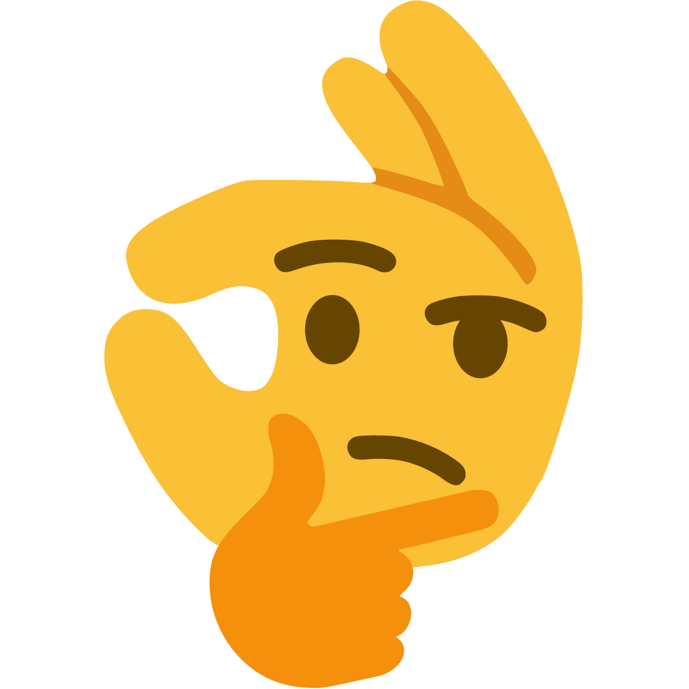
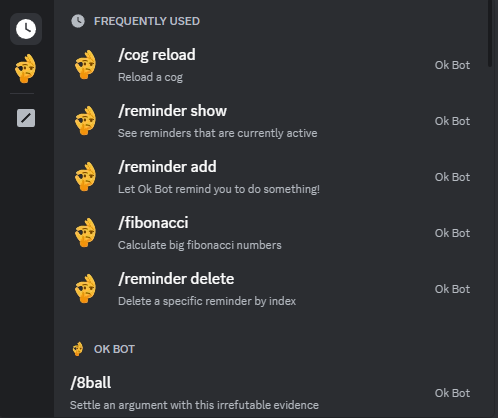

<a id="readme-top"></a>

[![Contributors][contributors-shield]][contributors-url]
[![Forks][forks-shield]][forks-url]
[![Stargazers][stars-shield]][stars-url]
[![Issues][issues-shield]][issues-url]
[![MIT license][license-shield]][license-url]

<br />
<div align="center">
  <a href="https://github.com/BenjaminHGong/ok-bot">
    
  </a>

<h3 align="center">Ok Bot</h3>

  <p align="center">
    An all-purpose Discord bot with AI chat, a chaotic economy, Brawl Stars tools, voice channel features, and more.
    <br />
    <a href="https://github.com/BenjaminHGong/ok-bot"><strong>Explore the docs »</strong></a>
    <br />
    <br />
    <a href="https://github.com/BenjaminHGong/ok-bot/issues/new?labels=bug&template=bug-report---.md">Report Bug</a>
    &middot;
    <a href="https://github.com/BenjaminHGong/ok-bot/issues/new?labels=enhancement&template=feature-request---.md">Request Feature</a>
  </p>
</div>

<details>
  <summary>Table of Contents</summary>
  <ol>
    <li>
      <a href="#about-the-project">About The Project</a>
      <ul>
        <li><a href="#built-with">Built With</a></li>
      </ul>
    </li>
    <li>
      <a href="#getting-started">Getting Started</a>
      <ul>
        <li><a href="#prerequisites">Prerequisites</a></li>
        <li><a href="#installation">Installation</a></li>
        <li><a href="#discord-developer-portal-setup">Discord Developer Portal Setup</a></li>
      </ul>
    </li>
    <li><a href="#commands">Commands</a></li>
    <li><a href="#contributing">Contributing</a></li>
    <li><a href="#license">License</a></li>
    <li><a href="#contact">Contact</a></li>
    <li><a href="#acknowledgments">Acknowledgments</a></li>
  </ol>
</details>

## About The Project

Ok Bot is a Discord bot built with Python and [py-cord](https://docs.pycord.dev/). It features an AI chat powered by Google Gemini, a full economy system with shops and gambling, Brawl Stars reference tools, voice channel commands with TTS, and a variety of utility commands.

When mentioned in chat, Ok Bot responds using Gemini with a sarcastic, internet-coded personality. It can also award or fine users coins based on how it "feels" about messages.

<p align="right">(<a href="#readme-top">back to top</a>)</p>

### Built With

* [![Python]][Python-url]
* [![py-cord]][py-cord-url]
* [![SQLite]][SQLite-url]
* [![Gemini API]][Gemini-url]

<p align="right">(<a href="#readme-top">back to top</a>)</p>

## Getting Started

### Prerequisites

* [Python 3.8+](https://www.python.org/downloads/)
* [FFMPEG](https://www.ffmpeg.org/) (required for voice channel features)
* A [Discord bot token](https://discord.com/developers/applications/)
* A [Google Gemini API key](https://aistudio.google.com/apikey)

### Installation

```bash
git clone https://github.com/BenjaminHGong/ok-bot.git
cd ok-bot
pip install -r requirements.txt
```

Create a `.env` file in the project root with your tokens:

```
DISCORD_TOKEN=your_discord_bot_token
GEMINI_API_KEY=your_gemini_api_key
```

Run the setup script to initialize data files:

```bash
python bot/setup.py
```

Then start the bot:

```bash
python bot/main.py
```

If done correctly, the terminal should output:

```
Brawl Stars commands loaded
Economy commands loaded
Fun commands loaded
Misc commands loaded
Utility commands loaded
VC commands loaded
Ok Bot#XXXX has connected to Discord!
```

### Discord Developer Portal Setup

1. Create an application at the [Discord Developer Portal](https://discord.com/developers/applications/).
2. Under **OAuth2**, enable the `applications.commands` scope.
3. Under the **Bot** tab, enable **Server Members Intent** and **Message Content Intent**.

<p align="right">(<a href="#readme-top">back to top</a>)</p>

## Commands



### AI Chat
| Command | Description |
|---------|-------------|
| `@Ok Bot` | Mention the bot to chat. It responds with a sarcastic Gemini-powered personality and occasionally awards/fines coins. |
| `/stop` | Stop Ok Bot's current response in this channel |
| `/clear` | Clear the chat history with Ok Bot in this channel |

### Economy
| Command | Description |
|---------|-------------|
| `/bal` | Check anyone's wallet and bank balance |
| `/baltop` | Leaderboard of the richest users |
| `/beg` | Beg for free money (random payout with jackpot odds) |
| `/welfare` | Claim a 10,000 coin safety net when you're completely broke |
| `/work` | Earn coins from your job (requires a Job Contract) |
| `/rob` | Rob another user (35% success rate, bounty system on failure) |
| `/gamble` | Double or nothing against the bot |
| `/deposit` | Move coins from wallet to bank |
| `/withdraw` | Move coins from bank to wallet |
| `/transfer` | Send coins to another user |
| `/shop` | Browse the main item shop |
| `/botshop` | Browse the bot configuration shop (change Ok Bot's AI model, brain, etc.) |
| `/config` | See Ok Bot's current AI configuration |
| `/buy` | Buy an item from either shop |
| `/sell` | Sell an item from your bag |
| `/use` | Use an item in your bag |
| `/bag` | View your bag contents |

### Brawl Stars
| Command | Description |
|---------|-------------|
| `/drops` | Look up Starr Drop item drop chances by rarity and item |
| `/ct` | Look up brawler counters |
| `/map` | Get detailed drafting info for any Power League map |

### Voice Channel
| Command | Description |
|---------|-------------|
| `/vc join` | Join your current voice channel |
| `/vc leave` | Leave the voice channel |
| `/vc say` | Make Ok Bot speak using Gemini TTS |
| `/vc soundboard` | Play a sound from the soundboard |
| `/vc debug` | Debug voice playback status |

### Utility
| Command | Description |
|---------|-------------|
| `/ping` | Check bot latency |
| `/poll` | Create a reaction-based poll |
| `/ar` | Autorespond group: create, edit, delete, and show keyword triggers |
| `/reminder` | Reminder group: add, show, edit, and delete timed reminders |
| `/mute` | Mute a user (owner only) |
| `/unmute` | Unmute a user (owner only) |

### Misc
| Command | Description |
|---------|-------------|
| `/fibonacci` | Calculate massive fibonacci numbers (up to the 1,000,000th term) |

<p align="right">(<a href="#readme-top">back to top</a>)</p>

## Contributing

Contributions are what make the open source community such an amazing place to learn, inspire, and create. Any contributions you make are **greatly appreciated**.

1. Fork the Project
2. Create your Feature Branch (`git checkout -b feature/AmazingFeature`)
3. Commit your Changes (`git commit -m 'Add some AmazingFeature'`)
4. Push to the Branch (`git push origin feature/AmazingFeature`)
5. Open a Pull Request

<p align="right">(<a href="#readme-top">back to top</a>)</p>

### Top contributors:

<a href="https://github.com/BenjaminHGong/ok-bot/graphs/contributors">
  
</a>

## License

Distributed under the MIT License. See `LICENSE` for more information.

<p align="right">(<a href="#readme-top">back to top</a>)</p>

## Contact

Benjamin Gong - benjaminhgong@gmail.com

Project Link: [https://github.com/BenjaminHGong/ok-bot](https://github.com/BenjaminHGong/ok-bot)

<p align="right">(<a href="#readme-top">back to top</a>)</p>

## Acknowledgments

* [py-cord](https://docs.pycord.dev/)
* [Google Gemini API](https://ai.google.dev/)
* [Code With Swastik](https://www.youtube.com/@CodeWithSwastik)
* [Nayuki](https://www.nayuki.io/)
* [Starr Drop rates images](https://www.reddit.com/r/Brawlstars/comments/14pxyx8/these_are_the_exact_drop_chances_of_starr_drops/)
* [SpenLC](https://www.youtube.com/channel/UCsuS8BRN4y6_QoBvAqTtSSg)
* [Othneil Drew](https://github.com/othneildrew) (README template inspiration)

<p align="right">(<a href="#readme-top">back to top</a>)</p>

<!-- MARKDOWN LINKS & IMAGES -->
[contributors-shield]: https://img.shields.io/github/contributors/BenjaminHGong/ok-bot.svg?style=for-the-badge
[contributors-url]: https://github.com/BenjaminHGong/ok-bot/graphs/contributors
[forks-shield]: https://img.shields.io/github/forks/BenjaminHGong/ok-bot.svg?style=for-the-badge
[forks-url]: https://github.com/BenjaminHGong/ok-bot/network/members
[stars-shield]: https://img.shields.io/github/stars/BenjaminHGong/ok-bot.svg?style=for-the-badge
[stars-url]: https://github.com/BenjaminHGong/ok-bot/stargazers
[issues-shield]: https://img.shields.io/github/issues/BenjaminHGong/ok-bot.svg?style=for-the-badge
[issues-url]: https://github.com/BenjaminHGong/ok-bot/issues
[license-shield]: https://img.shields.io/github/license/BenjaminHGong/ok-bot.svg?style=for-the-badge
[license-url]: https://github.com/BenjaminHGong/ok-bot/blob/main/LICENSE
[Python]: https://img.shields.io/badge/Python-3776AB?style=for-the-badge&logo=python&logoColor=white
[Python-url]: https://python.org
[py-cord]: https://img.shields.io/badge/py--cord-5865F2?style=for-the-badge&logo=discord&logoColor=white
[py-cord-url]: https://docs.pycord.dev/
[SQLite]: https://img.shields.io/badge/SQLite-003B57?style=for-the-badge&logo=sqlite&logoColor=white
[SQLite-url]: https://www.sqlite.org/
[Gemini API]: https://img.shields.io/badge/Gemini_API-4285F4?style=for-the-badge&logo=google&logoColor=white
[Gemini-url]: https://ai.google.dev/
