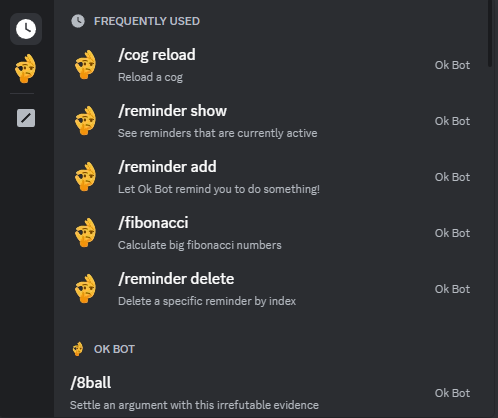

# ok-bot

Ok Bot is a versatile and customizable Discord bot designed to enhance your server experience. With a wide range of commands catering to various needs, Ok Bot aims to make your Discord interactions more enjoyable and efficient.

## Getting Started

To start using Ok Bot on your server, follow these instructions to add and configure the bot.

## Prerequisites

*  [Python](https://www.python.org/downloads/)
*  [FFMPEG](https://www.ffmpeg.org/)


## Installing

You can install the required dependencies using the following command:
```
pip install -r requirements.txt
```

If you haven't already, create an application in the [developer portal](https://discord.com/developers/applications/).

### Required permissions

Ensure that the `applications.commands` application scope is enabled for your bot. You can locate this setting under the `OAuth2` section within the [developer portal](https://discord.com/developers/applications/).

Activate the `Server Members Intent` and `Message Content Intent` by navigating to the `Bot` tab in the [developer portal](https://discord.com/developers/applications/).

### Configuration

After cloning the project and installing all dependencies, you need to add your Discord API token in the `.env` file.
```bash
# Clone the repository
git clone https://github.com/BenjaminHGong/ok-bot.git

# Navigate to the project directory
cd ok-bot

# Configure Discord Bot Token
echo "DISCORD_TOKEN='INSERT_YOUR_TOKEN_HERE'" > .env

# Go into main.py and edit dotenv_path on line 17
dotenv_path = Path(r"insert .env path here")

# Run the setup file
python bot/setup.py
```

### Starting the application

```bash
python bot/main.py
```
You can also run it in VS Code.
If done correctly, the terminal should output
```
Brawl Stars commands loaded
Economy commands loaded
Fun commands loaded
Misc commands loaded
Utility commands loaded
VC commands loaded
Bot Name#XXXX has connected to Discord!
```
You should now be able to see the bot being online and having a menu of slash commands:


## Commands

* /8ball: Similar to a magic 8Ball but with it's own personality.
* /ar: Automatically respond to specific keywords
* /bag: Check what items you have
* /bal: Check anyone's Ok Bot balance
* /baltop: Check out the richest people
* /beg: Beg for free money
* /buy: Buy something with your coins
* /ct: Look up the counters of brawlers in brawl stars
* /deposit: Deposit coins into the bank
* /drops: See the drop chances of items in Starr Drops
* /fibonacci: Calculate big fibonacci numbers
* /gamble: A unconventional gambling command for the economy
* /grammar: Toggle annoying grammar suggestions
* /map: Get detailed info on drafting on any Power League map
* /mute: A really useless version of the timeout command. Deletes messages of blacklisted users.
* /ping: See if the bot is up
* /poll: Make a custom poll
* /reminder: Create, edit, and delete reminders
* /rob: Rob someone
* /rsw: Generate random sussy words
* /sell: Sell items in your bag
* /shop: Check out what items you can buy with your coins
* /unmute: Unmutes blacklisted users.
* /use: Use something in your bag
* /vc: Group of voice channel commands
* /withdraw: Withdraw coins from the bank

## License

This project is licensed under the MIT License - see the [LICENSE.md](LICENSE) file for details

## Acknowledgments
* [Code With Swastik](https://www.youtube.com/@CodeWithSwastik)
* [Nayuki](https://www.nayuki.io/)
* [Starr Drop rates images](https://www.reddit.com/r/Brawlstars/comments/14pxyx8/these_are_the_exact_drop_chances_of_starr_drops/)
* [SpenLC](https://www.youtube.com/channel/UCsuS8BRN4y6_QoBvAqTtSSg)
